# Лабораторна робота №1  
## Робота з СУБД PostgreSQL та основи SQL

## 🎯 Мета роботи
Ознайомитися з основами роботи з реляційною базою даних PostgreSQL, навчитися підключатися до хмарної СУБД Supabase, досліджувати структуру бази даних та виконувати базові SQL-запити з використанням команди SELECT.

**Здобувач освіти:** Романюк Андрій

**Група:** ІПЗ-31

**Обраний рівень складності:** 1

## Хід роботи

1. Зареєстровано обліковий запис у сервісі Supabase.
2. Створено новий проєкт.
3. Імпортовано файл `technomart.sql` через SQL Editor.
4. Перевірено створення та наповнення таблиць бази даних.
5. Виконано SQL-запити рівня 1 з використанням:
   - SELECT
   - WHERE
   - ORDER BY
   - LIMIT
6. Зроблено скріншоти результатів виконання запитів.

## Виконання завдань

### 1 Основні SELECT-запити

**Отримання всіх записів з таблиці customers**
```sql
SELECT * FROM customers;
```

Запит використовується для перегляду всіх даних таблиці клієнтів.

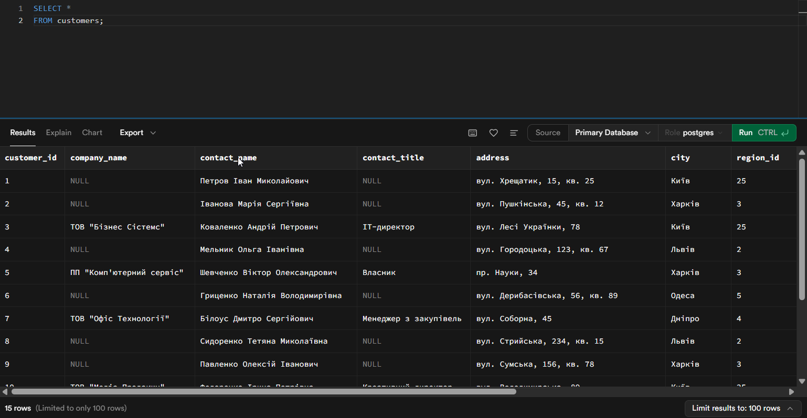

**Виведення назв товарів та їхніх цін**
```sql
SELECT product_name, unit_price
FROM products;
```

Запит показує лише необхідні колонки з таблиці товарів.

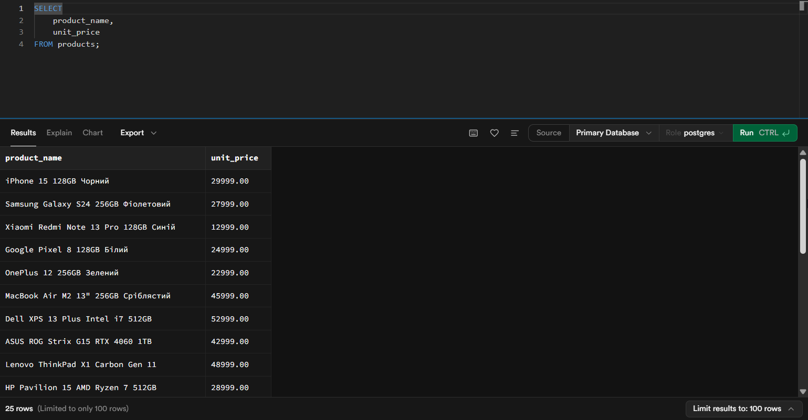

**Контактні дані співробітників**
```sql
SELECT first_name, last_name, phone, email
FROM employees;
```

Запит використовується для отримання контактної інформації працівників.

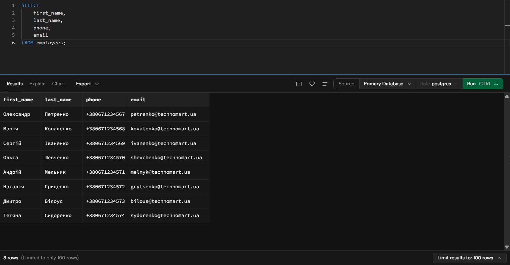

## 2 Фільтрація даних (WHERE)

**Клієнти з міста Київ**
```sql
SELECT * FROM customers
WHERE city = 'Київ';
```

Запит відбирає клієнтів, які проживають у місті Київ.

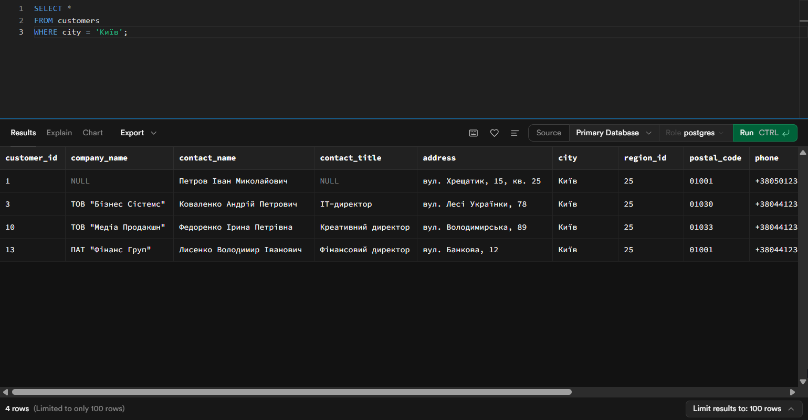

**Товари дорожчі за 25000 грн**
```sql
SELECT product_name, unit_price
FROM products
WHERE unit_price > 25000;
```

Запит дозволяє знайти дорогі товари.

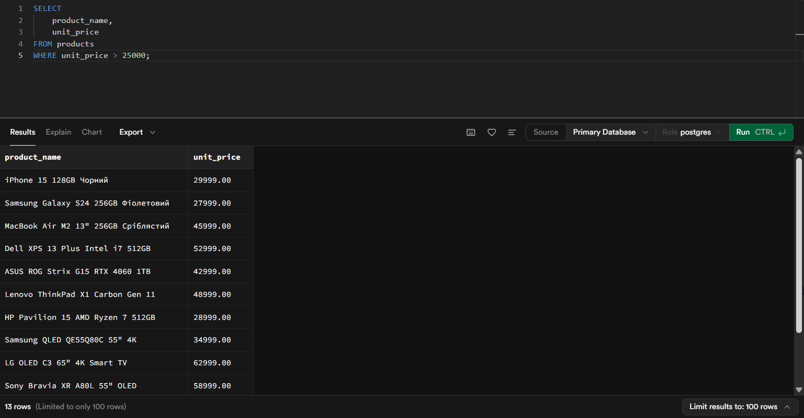

**Замовлення зі статусом delivered**
```sql
SELECT *
FROM orders
WHERE order_status = 'delivered';
```

Запит використовується для пошуку доставлених замовлень.


**Співробітники відділу продажів**
```sql
SELECT first_name, last_name, title, phone, email
FROM employees
WHERE title ILIKE '%продаж%';
```

Запит знаходить співробітників, посада яких пов’язана з продажами.

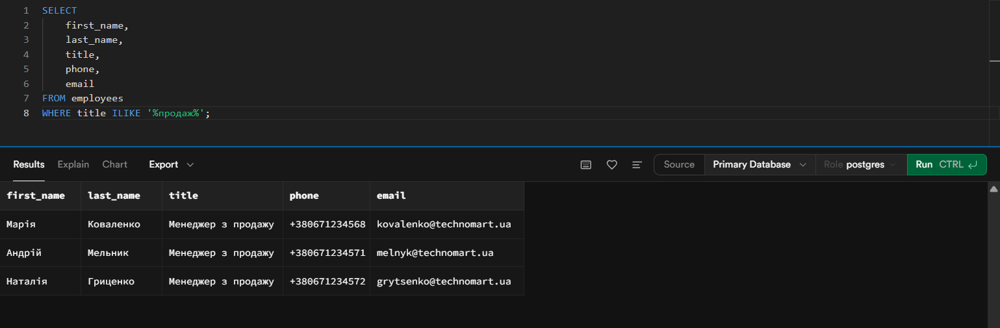

## 3 Сортування результатів (ORDER BY)

**Сортування товарів за ціною**
```sql
SELECT product_name, unit_price
FROM products
ORDER BY unit_price ASC;
```

Запит впорядковує товари за зростанням ціни.

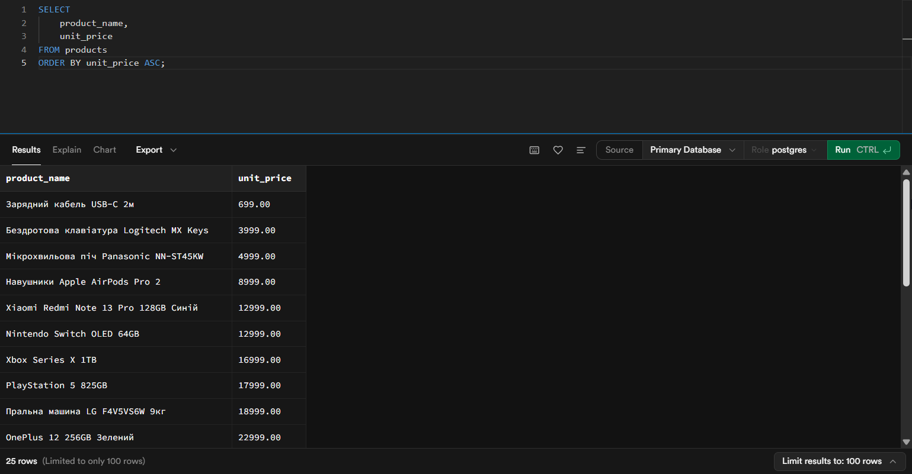

**Клієнти в алфавітному порядку**
```sql
SELECT contact_name, city, phone
FROM customers
ORDER BY contact_name ASC;
```

Запит сортує клієнтів за іменем контактної особи.

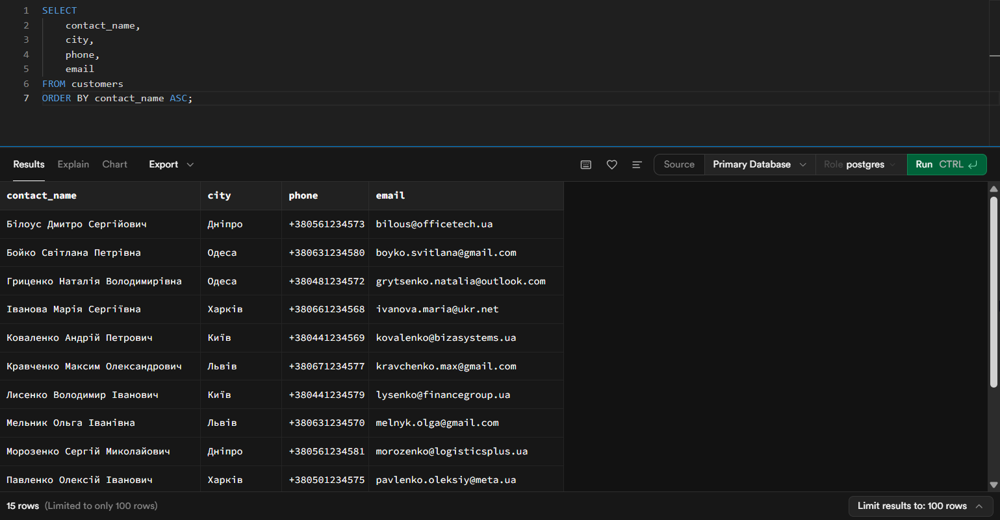

**Замовлення від найновіших до найстаріших**
```sql
SELECT order_id, order_date, order_status
FROM orders
ORDER BY order_date DESC;
```

Запит дозволяє переглянути останні замовлення.

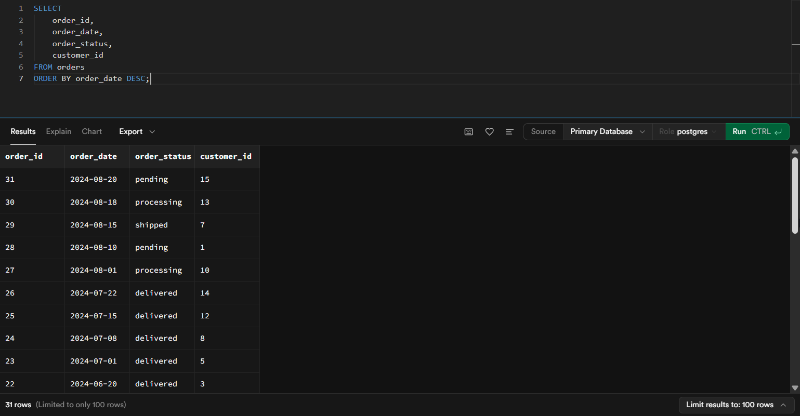

## 4 Обмеження кількості результатів (LIMIT)

**Топ-10 найдорожчих товарів**
```sql
SELECT product_name, unit_price
FROM products
ORDER BY unit_price DESC
LIMIT 10;
```

Запит виводить 10 найдорожчих товарів.

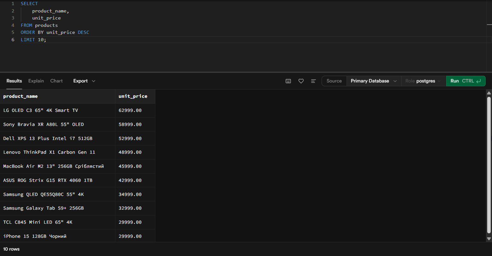

**Останні 5 замовлень**
```sql
SELECT order_id, order_date, order_status
FROM orders
ORDER BY order_date DESC
LIMIT 5;
```

Запит використовується для перегляду останніх замовлень.

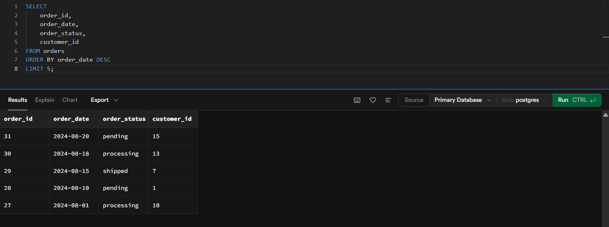

**Перші 8 клієнтів за алфавітом**
```sql
SELECT contact_name, city, phone
FROM customers
ORDER BY contact_name ASC
LIMIT 8;
```

Запит демонструє використання LIMIT для обмеження результатів.

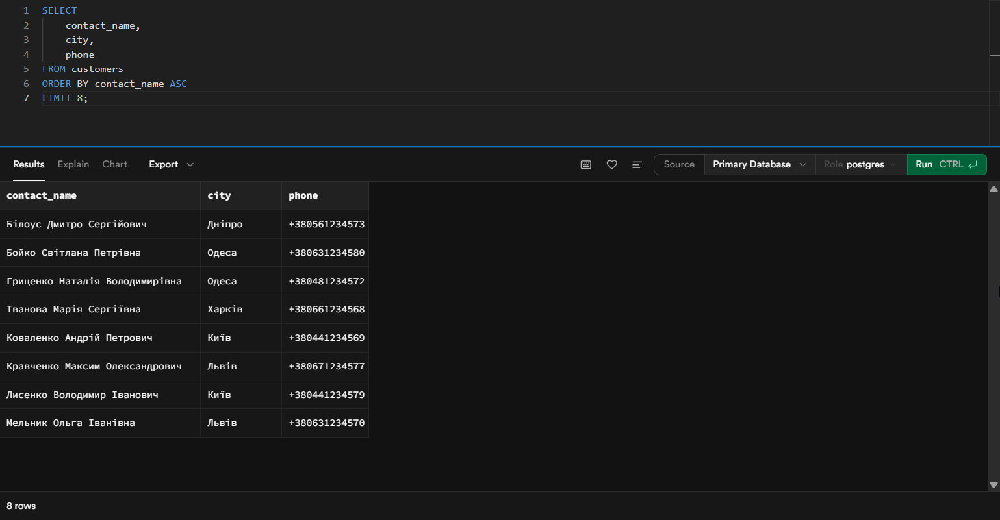

# Висновок

Під час виконання лабораторної роботи було створено проєкт PostgreSQL у Supabase, імпортовано навчальну базу даних та виконано базові SQL-запити для отримання, фільтрації, сортування й обмеження даних.

