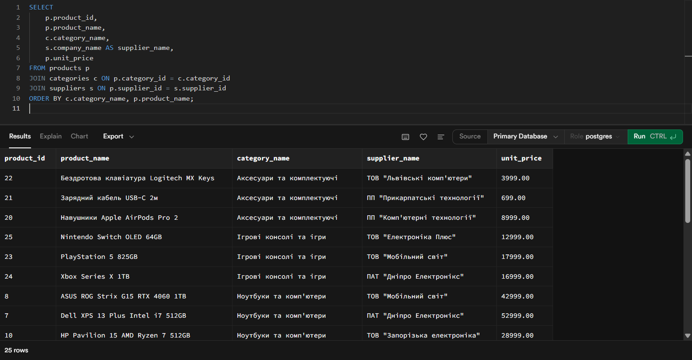
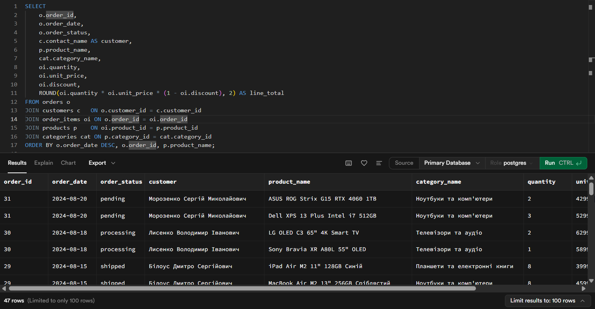
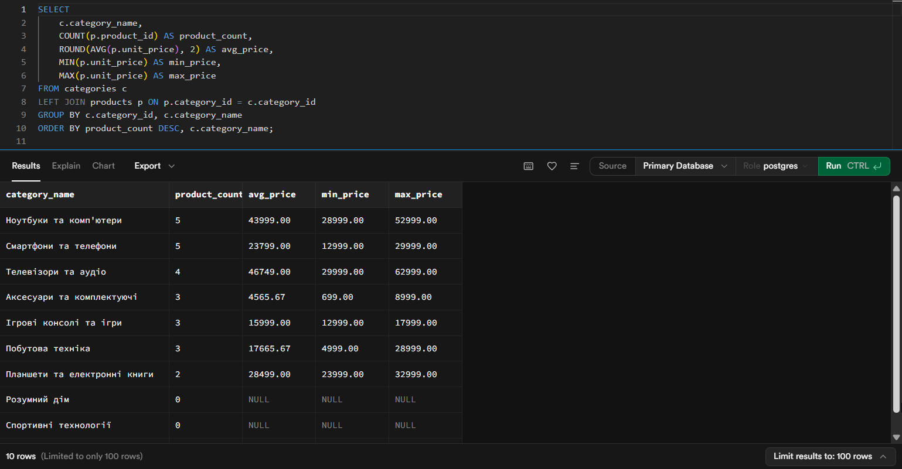
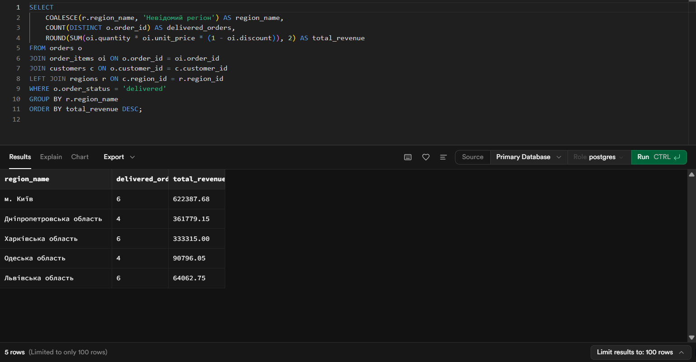
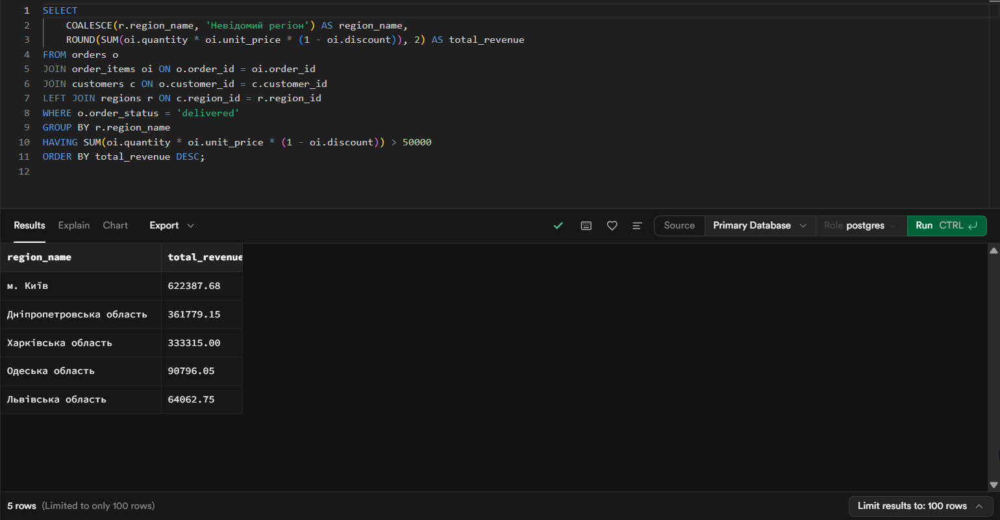
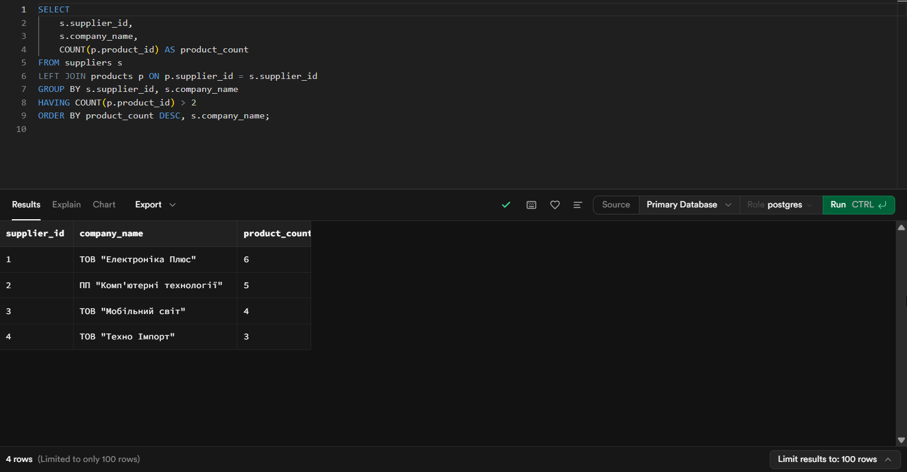
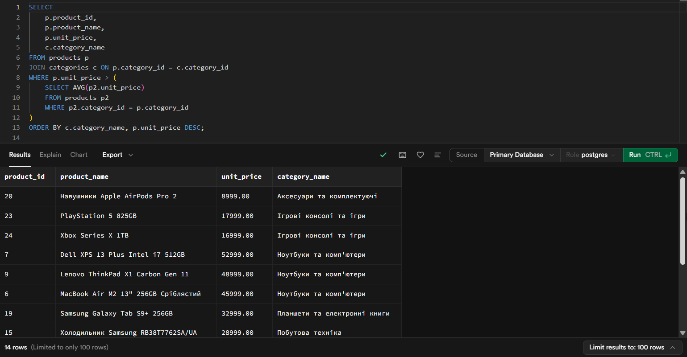
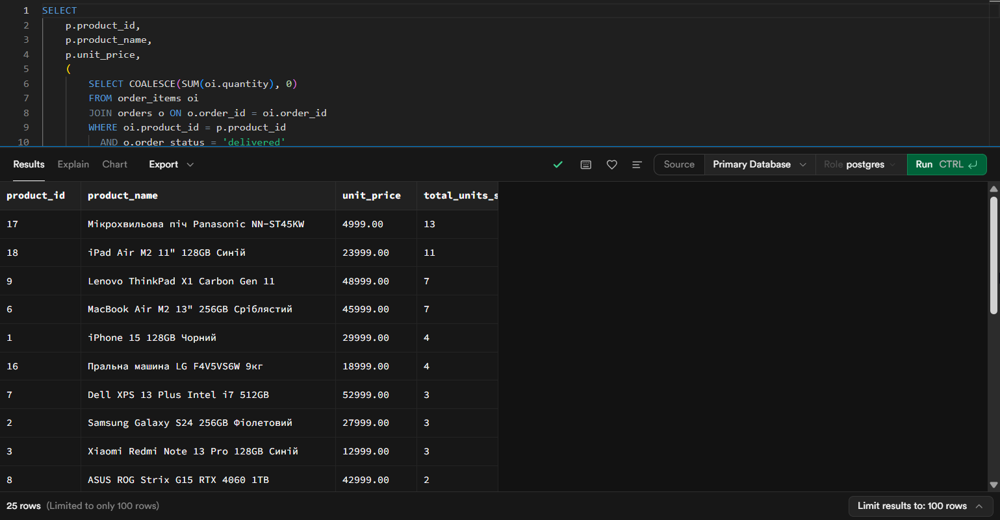
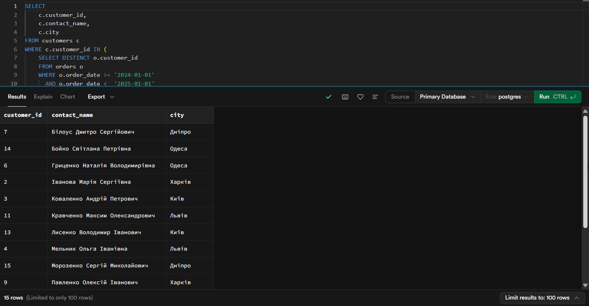
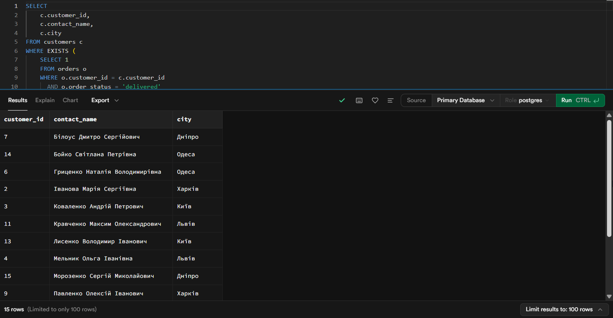

# Лабораторна робота №2
## Створення складних SQL запитів

## 🎯 Мета роботи
Набути практичних навичок створення складних SQL запитів для аналізу даних, опанувати техніки з'єднання таблиць, використання агрегатних функцій, групування даних та написання підзапитів для розв'язання аналітичних завдань у реляційних базах даних.

**Здобувач освіти:** Романюк Андій

**Група:** ІПЗ-31

**Обраний рівень складності:** 1

## Хід роботи

## 1. З’єднання таблиць (JOIN)

### 1.1 INNER JOIN (products + categories + suppliers)
**Бізнес-логіка:** отримати список товарів із назвою категорії та постачальника для аналізу асортименту.
```sql
SELECT
    p.product_id,
    p.product_name,
    c.category_name,
    s.company_name AS supplier_name,
    p.unit_price
FROM products p
JOIN categories c ON p.category_id = c.category_id
JOIN suppliers s ON p.supplier_id = s.supplier_id
ORDER BY c.category_name, p.product_name;
```



### 1.2 LEFT JOIN (всі клієнти + кількість замовлень)

Бізнес-логіка: бачити всіх клієнтів, включно з тими, хто ще не робив замовлень (для маркетингу/реактивації).
```sql
SELECT
    c.customer_id,
    c.contact_name,
    c.customer_type,
    r.region_name,
    COUNT(o.order_id) AS order_count
FROM customers c
LEFT JOIN orders o ON c.customer_id = o.customer_id
LEFT JOIN regions r ON c.region_id = r.region_id
GROUP BY c.customer_id, c.contact_name, c.customer_type, r.region_name
ORDER BY order_count DESC, c.contact_name;
```


### 1.3 Множинні з’єднання (orders + customers + order_items + products + categories)

Бізнес-логіка: отримати деталізацію замовлень і розрахувати суму позиції.
```sql
SELECT
    o.order_id,
    o.order_date,
    o.order_status,
    c.contact_name AS customer,
    p.product_name,
    cat.category_name,
    oi.quantity,
    oi.unit_price,
    oi.discount,
    ROUND(oi.quantity * oi.unit_price * (1 - oi.discount), 2) AS line_total
FROM orders o
JOIN customers c   ON o.customer_id = c.customer_id
JOIN order_items oi ON o.order_id = oi.order_id
JOIN products p    ON oi.product_id = p.product_id
JOIN categories cat ON p.category_id = cat.category_id
ORDER BY o.order_date DESC, o.order_id, p.product_name;
```




## 2. Агрегатні функції та GROUP BY / HAVING

### 2.1 Статистика товарів по категоріях (COUNT/AVG/MIN/MAX)

Бізнес-логіка: оцінка насиченості категорій та цінових меж.
```sql
SELECT
    c.category_name,
    COUNT(p.product_id) AS product_count,
    ROUND(AVG(p.unit_price), 2) AS avg_price,
    MIN(p.unit_price) AS min_price,
    MAX(p.unit_price) AS max_price
FROM categories c
LEFT JOIN products p ON p.category_id = c.category_id
GROUP BY c.category_id, c.category_name
ORDER BY product_count DESC, c.category_name;
```



### 2.2 Продажі по регіонах (SUM + GROUP BY)

Бізнес-логіка: визначити найбільш прибуткові регіони.
```sql
SELECT
    COALESCE(r.region_name, 'Невідомий регіон') AS region_name,
    COUNT(DISTINCT o.order_id) AS delivered_orders,
    ROUND(SUM(oi.quantity * oi.unit_price * (1 - oi.discount)), 2) AS total_revenue
FROM orders o
JOIN order_items oi ON o.order_id = oi.order_id
JOIN customers c ON o.customer_id = c.customer_id
LEFT JOIN regions r ON c.region_id = r.region_id
WHERE o.order_status = 'delivered'
GROUP BY r.region_name
ORDER BY total_revenue DESC;
```




### 2.3 HAVING (фільтрація груп)

Бізнес-логіка: показати лише регіони з доходом вище заданого порогу.
```sql
SELECT
    COALESCE(r.region_name, 'Невідомий регіон') AS region_name,
    ROUND(SUM(oi.quantity * oi.unit_price * (1 - oi.discount)), 2) AS total_revenue
FROM orders o
JOIN order_items oi ON o.order_id = oi.order_id
JOIN customers c ON o.customer_id = c.customer_id
LEFT JOIN regions r ON c.region_id = r.region_id
WHERE o.order_status = 'delivered'
GROUP BY r.region_name
HAVING SUM(oi.quantity * oi.unit_price * (1 - oi.discount)) > 50000
ORDER BY total_revenue DESC;
```




### 2.4 Постачальники з >2 товарами (HAVING)

Бізнес-логіка: знайти активних постачальників з ширшим асортиментом.
```sql
SELECT
    s.supplier_id,
    s.company_name,
    COUNT(p.product_id) AS product_count
FROM suppliers s
LEFT JOIN products p ON p.supplier_id = s.supplier_id
GROUP BY s.supplier_id, s.company_name
HAVING COUNT(p.product_id) > 2
ORDER BY product_count DESC, s.company_name;
```



## 3. Підзапити

### 3.1 Підзапит у WHERE

Бізнес-логіка: знайти “преміальні” товари в межах кожної категорії (вище середнього).

```sql
SELECT
    p.product_id,
    p.product_name,
    p.unit_price,
    c.category_name
FROM products p
JOIN categories c ON p.category_id = c.category_id
WHERE p.unit_price > (
    SELECT AVG(p2.unit_price)
    FROM products p2
    WHERE p2.category_id = p.category_id
)
ORDER BY c.category_name, p.unit_price DESC;
```



### 3.2 Підзапит у SELECT

Бізнес-логіка: додати до кожного товару кількість проданих одиниць.
```sql
SELECT
    p.product_id,
    p.product_name,
    p.unit_price,
    (
        SELECT COALESCE(SUM(oi.quantity), 0)
        FROM order_items oi
        JOIN orders o ON o.order_id = oi.order_id
        WHERE oi.product_id = p.product_id
          AND o.order_status = 'delivered'
    ) AS total_units_sold
FROM products p
ORDER BY total_units_sold DESC, p.product_name;
```



### 3.3 IN

```sql
SELECT
    c.customer_id,
    c.contact_name,
    c.city
FROM customers c
WHERE c.customer_id IN (
    SELECT DISTINCT o.customer_id
    FROM orders o
    WHERE o.order_date >= '2024-01-01'
      AND o.order_date <  '2025-01-01'
)
ORDER BY c.contact_name;
```



### 3.4 EXISTS

```sql
SELECT
    c.customer_id,
    c.contact_name,
    c.city
FROM customers c
WHERE EXISTS (
    SELECT 1
    FROM orders o
    WHERE o.customer_id = c.customer_id
      AND o.order_status = 'delivered'
)
ORDER BY c.contact_name;
```



# Висновок

У ході лабораторної роботи були створені SQL-запити з JOIN, агрегатними функціями, GROUP BY/HAVING та підзапитами. Отримані результати дозволяють виконувати базову аналітику продажів та структури даних інтернет-магазину.
