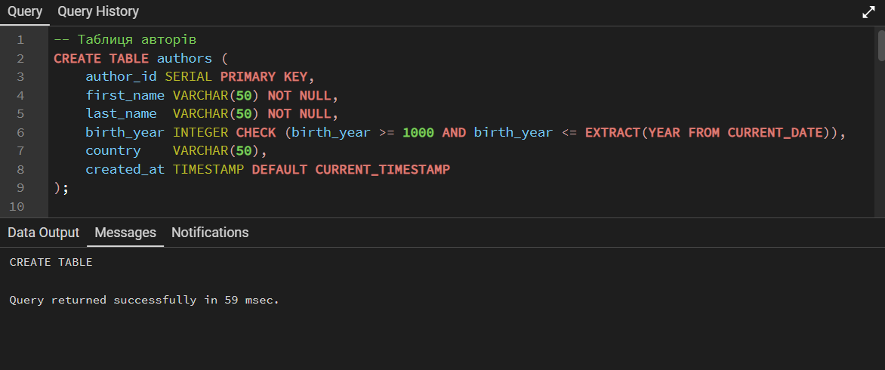
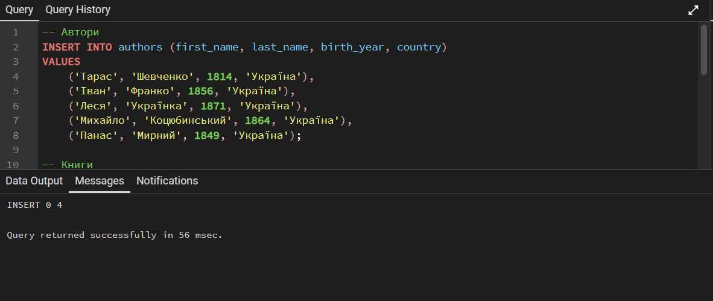
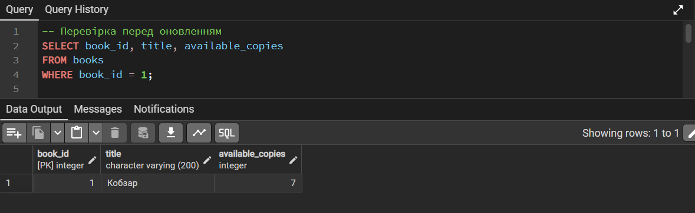
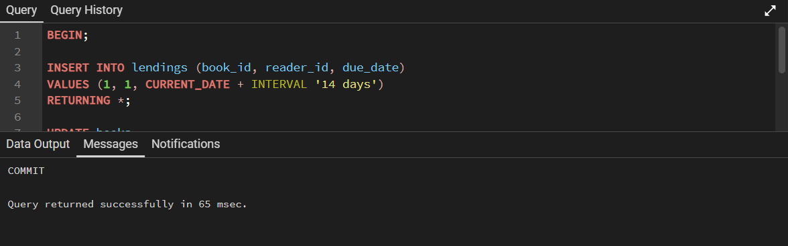
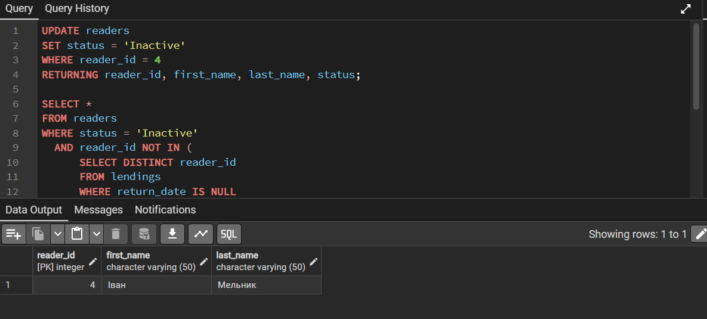

# Лабораторна робота №3
## Модифікація даних та транзакції (PostgreSQL)

### Мета роботи
Отримати практичні навички безпечної модифікації даних (INSERT/UPDATE/DELETE) у PostgreSQL, а також роботи з транзакціями (BEGIN/COMMIT/ROLLBACK) і обмеженнями цілісності (PRIMARY KEY, FOREIGN KEY, UNIQUE, CHECK, NOT NULL).

**Здобувач освіти:** Романюк Андрій

**Група:** ІПЗ-31

**Обраний рівень складності:** 1

## Виконання завдань

## 1. Створення структури БД з обмеженнями цілісності (DDL)

```sql
-- (не обов’язково, але зручно) прибрати старі таблиці якщо раптом вже створював
DROP TABLE IF EXISTS lendings CASCADE;
DROP TABLE IF EXISTS books CASCADE;
DROP TABLE IF EXISTS readers CASCADE;
DROP TABLE IF EXISTS authors CASCADE;

-- Таблиця авторів
CREATE TABLE authors (
    author_id SERIAL PRIMARY KEY,
    first_name VARCHAR(50) NOT NULL,
    last_name  VARCHAR(50) NOT NULL,
    birth_year INTEGER CHECK (birth_year >= 1000 AND birth_year <= EXTRACT(YEAR FROM CURRENT_DATE)),
    country    VARCHAR(50),
    created_at TIMESTAMP DEFAULT CURRENT_TIMESTAMP
);

-- Таблиця читачів
CREATE TABLE readers (
    reader_id SERIAL PRIMARY KEY,
    first_name VARCHAR(50) NOT NULL,
    last_name  VARCHAR(50) NOT NULL,
    email VARCHAR(100) UNIQUE NOT NULL,
    phone VARCHAR(20),
    library_card_number VARCHAR(20) UNIQUE NOT NULL,
    registration_date DATE DEFAULT CURRENT_DATE,
    status VARCHAR(20) DEFAULT 'Active' CHECK (status IN ('Active', 'Blocked', 'Inactive'))
);

-- Таблиця книг
CREATE TABLE books (
    book_id SERIAL PRIMARY KEY,
    isbn VARCHAR(17) UNIQUE NOT NULL,
    title VARCHAR(200) NOT NULL,
    author_id INTEGER NOT NULL,
    publication_year INTEGER CHECK (publication_year >= 1450),
    genre VARCHAR(50),
    total_copies INTEGER DEFAULT 1 CHECK (total_copies >= 0),
    available_copies INTEGER DEFAULT 1 CHECK (available_copies >= 0),
    created_at TIMESTAMP DEFAULT CURRENT_TIMESTAMP,
    FOREIGN KEY (author_id) REFERENCES authors(author_id) ON DELETE RESTRICT,
    CHECK (available_copies <= total_copies)
);

-- Таблиця видач книг
CREATE TABLE lendings (
    lending_id SERIAL PRIMARY KEY,
    book_id INTEGER NOT NULL,
    reader_id INTEGER NOT NULL,
    lending_date DATE DEFAULT CURRENT_DATE,
    due_date DATE NOT NULL,
    return_date DATE,
    FOREIGN KEY (book_id) REFERENCES books(book_id) ON DELETE RESTRICT,
    FOREIGN KEY (reader_id) REFERENCES readers(reader_id) ON DELETE RESTRICT,
    CHECK (due_date > lending_date),
    CHECK (return_date IS NULL OR return_date >= lending_date)
);
```



## 2. Ввставка тестових даних (INSERT)

```sql
-- Автори
INSERT INTO authors (first_name, last_name, birth_year, country)
VALUES
    ('Тарас', 'Шевченко', 1814, 'Україна'),
    ('Іван', 'Франко', 1856, 'Україна'),
    ('Леся', 'Українка', 1871, 'Україна'),
    ('Михайло', 'Коцюбинський', 1864, 'Україна'),
    ('Панас', 'Мирний', 1849, 'Україна');

-- Книги
INSERT INTO books (isbn, title, author_id, publication_year, genre, total_copies, available_copies)
VALUES
    ('978-966-03-4561-2', 'Кобзар', 1, 1840, 'Поезія', 10, 8),
    ('978-966-03-4562-9', 'Захар Беркут', 2, 1883, 'Історична проза', 5, 4),
    ('978-966-03-4563-6', 'Лісова пісня', 3, 1911, 'Драма', 7, 7),
    ('978-966-03-4564-3', 'Тіні забутих предків', 4, 1911, 'Повість', 6, 5),
    ('978-966-03-4565-0', 'Хіба ревуть воли, як ясла повні', 5, 1880, 'Повість', 4, 4);

-- Читачі
INSERT INTO readers (first_name, last_name, email, phone, library_card_number)
VALUES
    ('Олена', 'Петренко', 'olena.petrenko@email.com', '+380501234567', 'LIB-2024-001'),
    ('Андрій', 'Коваленко', 'andrii.kovalenko@email.com', '+380502345678', 'LIB-2024-002'),
    ('Марія', 'Сидоренко', 'maria.sydorenko@email.com', '+380503456789', 'LIB-2024-003'),
    ('Іван', 'Мельник', 'ivan.melnyk@email.com', '+380504567890', 'LIB-2024-004');

```



## 3. Безпечне оновлення (SELECT → UPDATE → SELECT)

```sql
-- Перевірка перед оновленням
SELECT book_id, title, available_copies
FROM books
WHERE book_id = 1;

-- Оновлення (з WHERE і додатковою умовою безпеки)
UPDATE books
SET available_copies = available_copies - 1
WHERE book_id = 1 AND available_copies > 0
RETURNING book_id, title, available_copies;

-- Перевірка після оновлення
SELECT book_id, title, available_copies
FROM books
WHERE book_id = 1;

```



available_copies змінилось з 8 на 7

## 4. Транзакція “видача книги” (BEGIN…COMMIT)

```sql
BEGIN;

-- Видача книги (створили запис)
INSERT INTO lendings (book_id, reader_id, due_date)
VALUES (1, 1, CURRENT_DATE + INTERVAL '14 days')
RETURNING *;

-- Зменшуємо доступні копії
UPDATE books
SET available_copies = available_copies - 1
WHERE book_id = 1 AND available_copies > 0
RETURNING book_id, title, available_copies;

COMMIT;

```



## 5. ROLLBACK на помилці (FK)

```sql
BEGIN;

DELETE FROM authors WHERE author_id = 1;

ROLLBACK;
```


## 6. Безпечне видалення (DELETE з умовою)

```sql
-- Робимо читача 4 неактивним (безпечно, з WHERE)
UPDATE readers
SET status = 'Inactive'
WHERE reader_id = 4
RETURNING reader_id, first_name, last_name, status;

-- Перевірка кого ми збираємось видалити
SELECT *
FROM readers
WHERE status = 'Inactive'
  AND reader_id NOT IN (
      SELECT DISTINCT reader_id
      FROM lendings
      WHERE return_date IS NULL
  );

-- Видалення
DELETE FROM readers
WHERE status = 'Inactive'
  AND reader_id NOT IN (
      SELECT DISTINCT reader_id
      FROM lendings
      WHERE return_date IS NULL
  )
RETURNING reader_id, first_name, last_name;

```



## Висновок

Під час роботи створено структуру БД бібліотеки з обмеженнями цілісності, виконано безпечні операції INSERT/UPDATE/DELETE та продемонстровано транзакції з COMMIT і ROLLBACK.


